# KlangLadder – Design Document

> Status: Draft v0.7 · Last updated: 2026-09-17
> Scope: Priority-based automatic switching of macOS default audio input/output devices. One native Swift menu bar app, distributed standalone or bundled in a Raycast extension.

### Changelog

- **v0.7**: Startup behavior decided: apply the priority list once per login session (G20, 6.6). No open questions left.
- **v0.6**: Resolved open questions. Added fallback matching for devices whose UID changed (5.3). System alert sound left alone. Menu bar shows icon only. Raycast extension reduced to "Open KlangLadder" for now. Update check, further Raycast commands and CLI mode moved to Future Work (13). Startup behavior clarified, still open.
- **v0.5**: Architecture rewritten around **one native Swift app** (engine + menu bar UI). The app ships standalone or bundled inside a Raycast extension, which adds Raycast commands on top. Raycast sends commands through a URL scheme. Raycast reads the device list through the app's **CLI mode** (preferred), with alternatives documented. The Raycast menu bar UI is replaced by a native SwiftUI popover with real tabs and a real expandable Disabled list. Old technical options A–E removed.
- **v0.4**: Added deleting disconnected devices. Deleting frees the device's slot, and devices below move up one. Replaces the old "Forget" action.
- **v0.3**: UI split into an Output tab and an Input tab. Each tab has its priority list first, then its own hidden, expandable Disabled list. The Disabled list is shown only when the active device of that tab is disabled. New devices always join the priority list at the lowest priority.
- **v0.2**: Disabled devices moved out of the priority list. Disabled devices act as infinitely low priority, and fallback to them is left to macOS. KlangLadder only acts on connect/disconnect, and only when at least one enabled device is connected. Explicit disconnect rule.
- **v0.1**: Initial draft.

---

## 1. Problem

macOS picks the default audio device on its own. It often switches to a newly connected device (for example, Bluetooth headphones or a monitor with speakers), and it does not remember user preferences across devices. Users with several devices (desk microphone, headset, AirPods, display speakers, virtual devices) must re-select the right device by hand.

KlangLadder lets the user keep a ranked list of devices, one for output and one for input. It changes the default device only when devices connect or disconnect, and always toward the highest-ranked device available.

## 2. Goals

### 2.1 Behavior

| # | Requirement |
|---|-------------|
| G1 | Two independent priority lists: **Output** and **Input**. |
| G3 | Disconnected devices **stay in the list** and are shown as disconnected. |
| G4 | **On connect**: if the new device ranks higher than the active device, switch to it. |
| G5 | **On disconnect of the active device**: switch to the highest-ranked connected device. |
| G6 | Manual changes through macOS Sound settings (or Control Center) are **respected** and not reverted. |
| G7 | Devices can be **disabled**. Disabled devices are not in the priority list. Each tab lists them in a separate, hidden but expandable **Disabled** list below the priority list. |
| G8 | Disabled devices have **infinitely low priority**. KlangLadder never selects one. If only disabled devices are connected, **macOS handles the fallback**. |
| G9 | KlangLadder **only acts** on connect/disconnect events (and once per login session at start, G20), and only when **at least one enabled device** is connected in that scope. |
| G12 | **Event-driven**, no polling. React to connect/disconnect hooks from the OS. |
| G14 | **New devices** join the priority list automatically, at the **lowest priority**. |
| G20 | At the **first app start of a login session**, apply the priority list once. Later app starts in the same session (restart, update, crash) only record state. |
| G15 | **Disconnected** devices (in the priority list or Disabled list) can be **deleted**. The slot is freed and every device below moves up one position, so no gaps remain. |

### 2.2 UI

| # | Requirement |
|---|-------------|
| G2 | UI lives in a **native menu bar item** of the KlangLadder app *(changed in v0.5, was: Raycast menu bar item)*. |
| G10 | The **active device is always highlighted**, including inside the Disabled list. |
| G11 | The Disabled list is **shown if and only if the active device of that tab is disabled**. Otherwise it is hidden, and the user can expand it. |
| G13 | The UI has **two tabs**: Output and Input. |

### 2.3 Architecture and distribution

| # | Requirement |
|---|-------------|
| G16 | **One Swift app** contains the engine and the menu bar UI. There is no second implementation of either. |
| G17 | The app can be installed **standalone**, or through a **Raycast extension** that bundles the same app and adds Raycast commands. |
| G18 | The primary channels need **no paid Apple Developer Program membership** ($99/year). The Mac App Store stays a later option with the same code. |
| G19 | Only **one instance** of the app runs, however it was installed. |

(Goal numbers are kept stable across versions so references in discussions stay valid.)

## 3. Non-goals (for now)

- Volume, balance, or input gain control.
- Per-app routing.
- Sample rate / format control.
- "System alert sound" output device (separate from default output). KlangLadder leaves it alone.
- Profiles (for example "Meeting" vs "Music").
- Syncing lists between Macs.
- A Raycast menu bar command (the app has its own menu bar item; two icons would compete).
- Showing the active device name in the menu bar. The menu bar item is **icon only**.

## 4. Key constraints

### 4.1 Raycast extensions are not long-running

Raycast commands run on demand. Raycast offers no way to keep a listener alive, except polling on an `interval`. **The engine therefore lives in the native app**, which runs all the time and starts at login. Raycast only sends commands to it (and, in future, reads from it).

### 4.2 macOS event source: Core Audio property listeners

Core Audio exposes property listeners on the system audio object. The relevant properties are:

- **Device list changed**: fires when any device appears or disappears.
- **Default output device changed**.
- **Default input device changed**.

Default devices are changed by writing the same properties. This API is public and needs no special entitlements. Listing and selecting devices should need no microphone permission (to verify, see 11).

### 4.3 Device identity

- The numeric device ID is **not stable**. It changes across reconnects and reboots.
- The device **UID** string is the persistent key. It is stable for most devices (Bluetooth UIDs are based on the MAC address).
- Some USB devices include the port location in the UID. Plugging into another port can then look like a new device. See fallback matching (5.3).
- One physical device can have both input and output streams (for example, a headset). It appears in each scope independently, with its own rank and its own enabled/disabled state.

### 4.4 Telling manual changes apart from macOS auto-switching

When a device connects, macOS itself often makes it the default. Core Audio reports that as "default device changed", which looks the same as a user change in System Settings. KlangLadder must tell them apart, or G4 and G6 conflict.

Proposed heuristic: a default-device change that arrives **within a short window** (about 1–2 s, tunable) after a device-list change, and that points at the **newly connected device**, counts as a **system auto-switch**. Every other default-device change counts as a **manual user choice**.

For G4, "the active device" means the default **before** the connect event, not the device macOS may have auto-switched to.

### 4.5 Distribution without a paid developer account

- **Notarization** requires the paid Apple Developer Program. Without it, a downloaded app is blocked by Gatekeeper until the user allows it in System Settings.
- **Official Homebrew casks** must be signed and notarized. Casks failing Gatekeeper checks are removed from the official tap as of September 2026.
- **Apps built locally** from source (by Homebrew or by Raycast's build of the extension) are not downloaded through a browser, so they should not get the quarantine flag that triggers Gatekeeper. This is the basis for the free channels (to verify, see 11).

## 5. Domain model

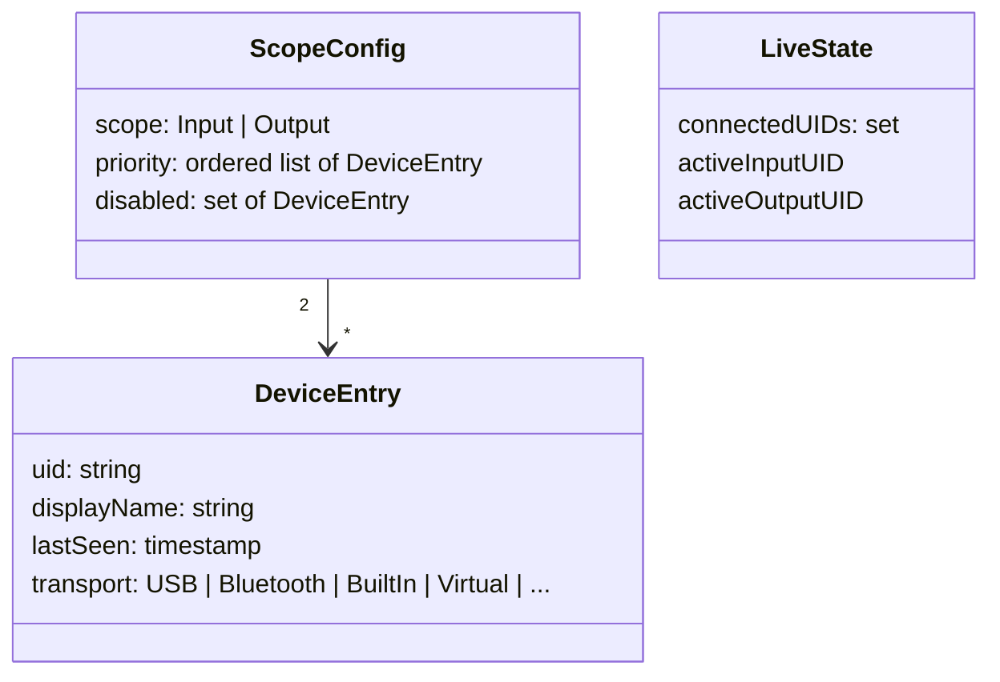

- **ScopeConfig** is persisted in one config file, written **only by the app**.
- **LiveState** is not persisted. Anyone who needs it (the app, or the app in CLI mode) reads it from Core Audio.

A device is in **exactly one** of `priority` or `disabled` per scope. Being enabled means being in the priority list; there is no separate flag.

**Effective rank** used by all switching rules:

| Device | Rank |
|---|---|
| In priority list at position *n* | *n* (1 = best) |
| Disabled | −∞ (never chosen by KlangLadder) |
| Unknown to KlangLadder | Added to bottom of priority list on first sight |

**Moving between groups**:

- **Disable**: remove from priority list, add to Disabled.
- **Enable**: remove from Disabled, append to the **bottom** of the priority list. The user then moves it up.
- **Delete**: see 5.1.
- None of these actions switches devices by itself (G9).

**New unknown devices** go to the **bottom** of the priority list (G14). Bottom rank means a new device only wins on connect if the active device is disabled or no enabled device is connected. Virtual devices from apps such as Zoom or Teams also land there. The user disables them once.

### 5.1 Deleting a device (G15)

**Allowed only when the device is disconnected**, in both the priority list and the Disabled list. Connected devices show no Delete action, because a connected device would be re-added at once as a new device (G14).

**Effect**:

- The entry is removed from its list in **that scope only**. A headset deleted from the Output tab stays in the Input tab.
- **Priority list**: every device below the deleted one moves up one position. Positions stay continuous (1, 2, 3, …).
- **Disabled list**: the entry is removed. No positions to close, since disabled devices are unranked.
- **Later reconnect**: the device counts as unknown again and joins the bottom of the priority list (G14). Its old position and disabled state are not restored.
- **No switch**: the device is disconnected, so it cannot be active. Deleting never changes the default device.

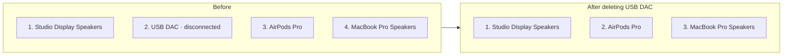

**Implementation note**: store the priority list as an **ordered array** and derive positions from the array index. Removing an element then closes the gap by itself. Never store position numbers, because they would need renumbering and could drift.

**Race**: the device may reconnect between opening the UI and clicking Delete. The engine checks connection state again when it applies the delete. If the device is connected by then, the delete is rejected and the UI shows a short error.

### 5.2 Display state

Derived display state of one entry, per scope:

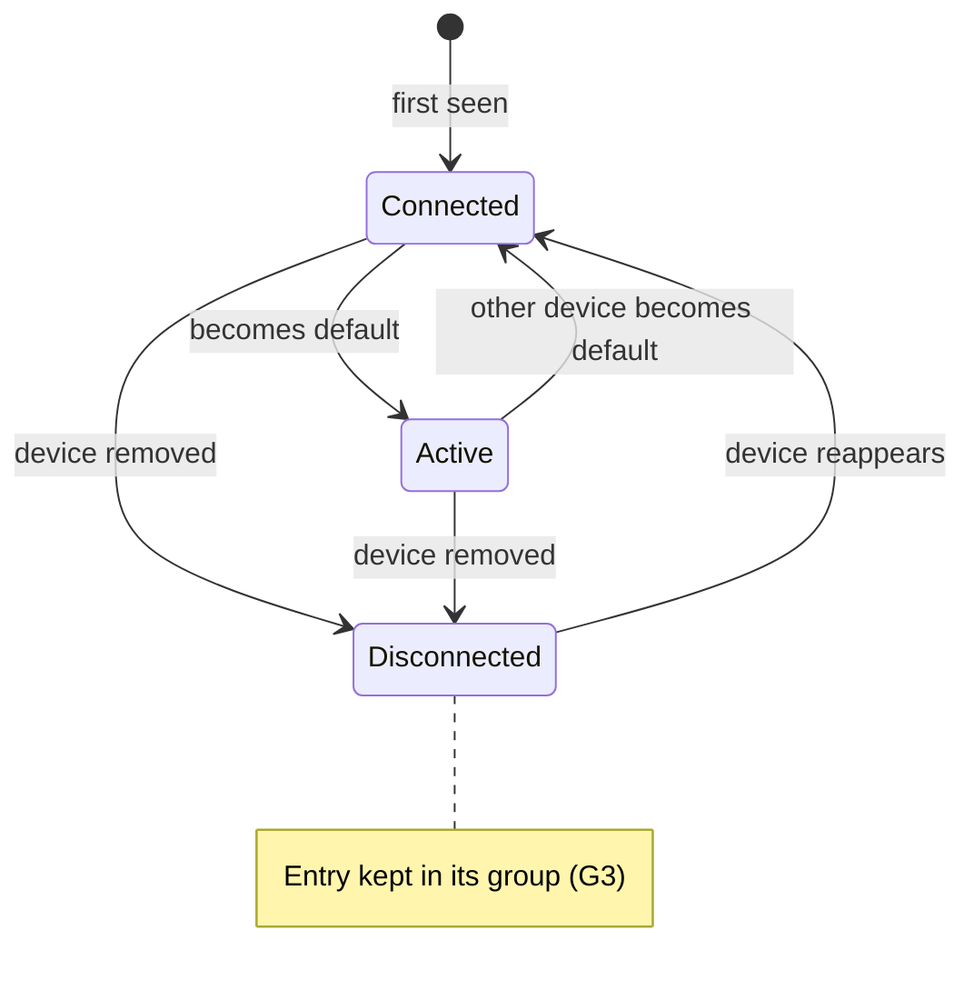

This state applies in both groups. A disabled device can be active, for example after a macOS fallback or a manual choice.

### 5.3 Fallback matching for changed UIDs

Some devices (mostly USB) get a different UID when plugged into another port. Without a fallback, the device would show up twice: the old entry stays disconnected, and a "new" entry lands at the bottom of the list.

When a device with an **unknown UID** connects, the engine looks for an existing entry before treating it as new:

1. Candidates: entries in the **same scope** that are **disconnected**.
2. A candidate matches if **name**, **transport type**, and **model identifier** (reported by Core Audio, when available) are all equal.
3. **Exactly one match**: the entry takes over the new UID. It keeps its position (or its place in the Disabled list). The device is then handled like a known device.
4. **Zero or several matches**: the device is treated as new (G14). Several matches happen with two identical interfaces; guessing there would mix up their positions.

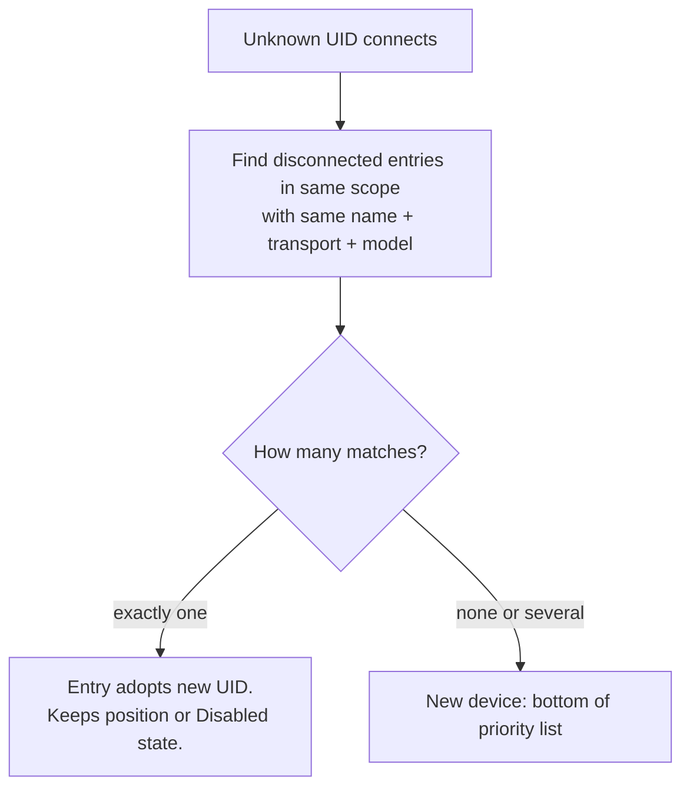

Matching runs per scope. A headset may match in Output and Input independently.

## 6. Switching rules

### 6.0 Guard (applies to every rule)

KlangLadder takes action only if:

1. The event is a device **connect**, a device **disconnect**, or the **first app start of a login session** (G9, G20), and
2. After the event, **at least one enabled device** (a device in the priority list) is connected in that scope.

If the guard fails, KlangLadder only updates state. macOS keeps whatever it chose (G8).

Config edits (reorder, enable, disable, delete) and manual default changes never trigger a switch.

### 6.1 On device connected

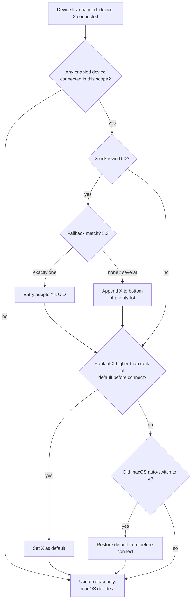

Consequences of the −∞ rank for disabled devices:

- A **disabled device connects**: it never outranks anything. If macOS auto-switches to it while an enabled device is connected, KlangLadder restores the previous default.
- An **enabled device connects while a disabled device is active**: the enabled device always ranks higher, so KlangLadder switches to it.
- A **higher-ranked device connects after a manual choice**: KlangLadder switches (G4 wins over the earlier manual choice). The manual choice holds until then (G6).

### 6.2 On device disconnected

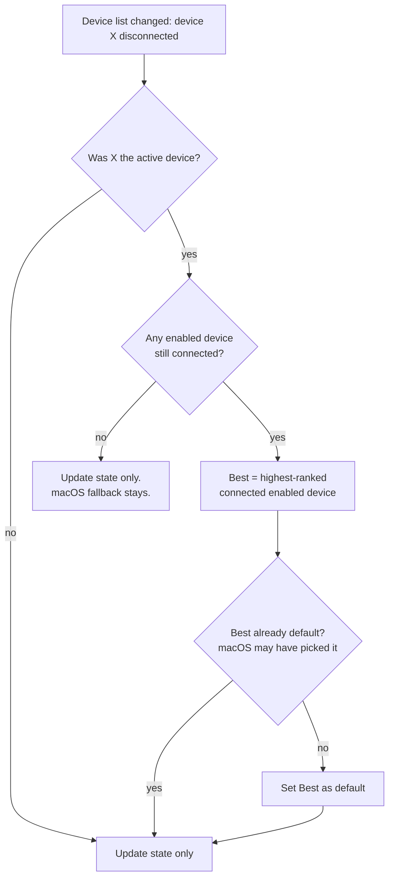

This rule overrides the macOS fallback when an enabled device is available, including when macOS falls back to a disabled device.

### 6.3 On manual change

Record state. Take no action (G6).

### 6.4 Rule summary

| Situation | Enabled device connected after event? | KlangLadder action |
|---|---|---|
| Enabled device connects, ranks above previous default | Yes | Switch to it |
| Device connects, ranks below previous default, macOS auto-switched | Yes | Restore previous default |
| Device connects, ranks below previous default, no auto-switch | Yes | None |
| Disabled device connects | No | None, macOS decides |
| Active device disconnects | Yes | Switch to best enabled device |
| Active device disconnects | No | None, macOS fallback |
| Non-active device disconnects | Any | None |
| User changes default manually | Any | None |
| User reorders, enables, disables, or deletes | Any | None |
| First app start in this login session | Yes | Switch to best enabled device, if not already default |
| Later app start in same login session | Any | None |

### 6.5 Sequence: headphones connect

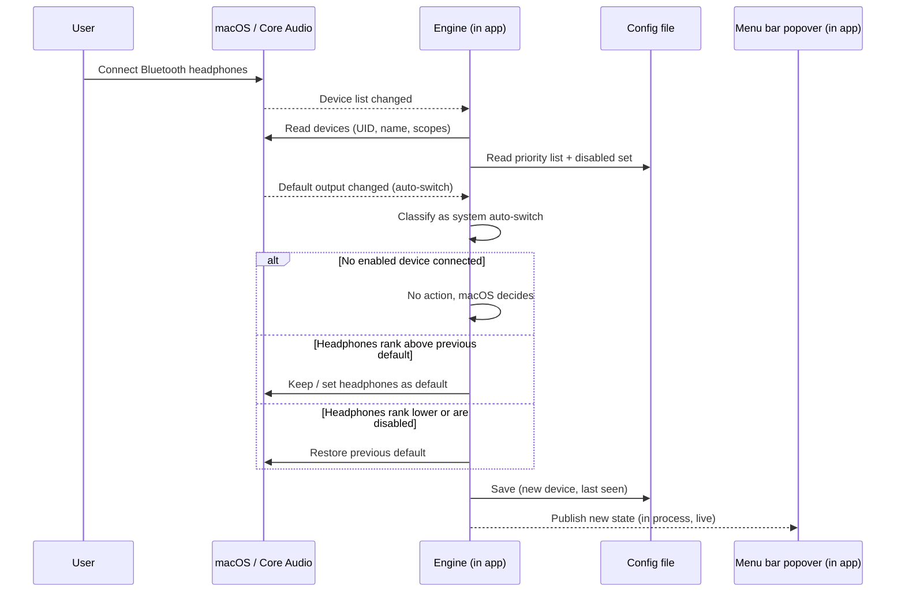

### 6.6 On app start (G20)

Devices already connected when the app starts produced no connect events. Rule:

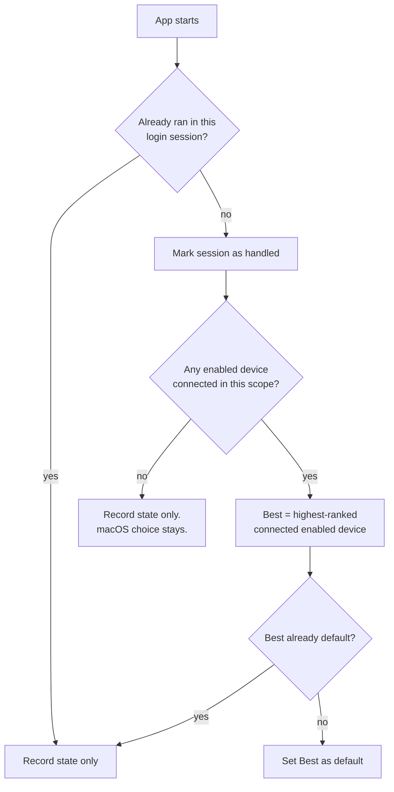

- Runs per scope (Output and Input independently).
- **Why once per session**: at login, the right device should be active. A restart later in the session (update, crash, manual quit) must not override a manual choice made since login.
- **Detecting the login session**: the app stores an identifier of the current login session (for example, derived from the session's login time) next to the config. If the stored identifier equals the current one, the app already ran in this session. The exact source of the identifier is to verify (S7).
- **Unknown devices** found at start join the bottom of the priority list (G14), with fallback matching (5.3) as usual.

## 7. Architecture

### 7.1 Overview

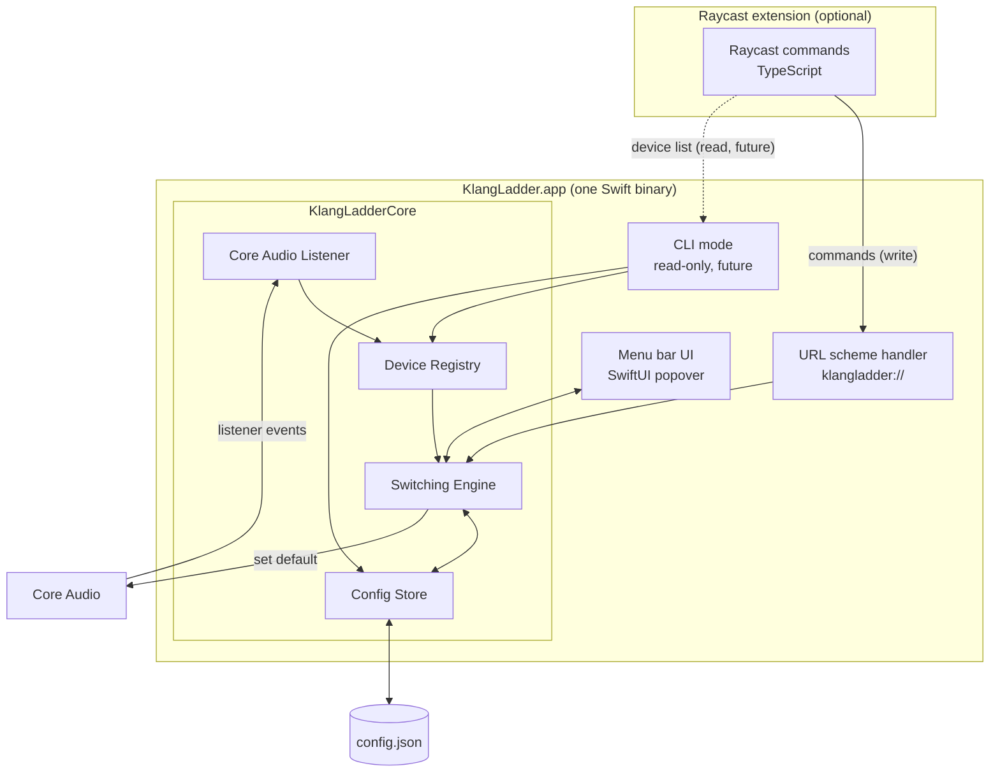

**Modes of the same binary**:

| Mode | Started by | Does |
|---|---|---|
| **App mode** (default) | Login item, user, or Raycast installer | Runs engine and menu bar UI. The only writer of config. |
| **CLI mode** (with arguments) *(future work)* | Raycast, Terminal | Prints devices and lists as JSON, then exits. Never writes config and never switches devices. |

**Code layout** (Swift package, high level):

- **KlangLadderCore**: device registry, switching rules, config store, Core Audio adapter. No UI. Holds all logic worth unit testing (table 6.4 as test cases).
- **KlangLadderUI**: SwiftUI views for the popover.
- **KlangLadder app target**: entry point. Chooses app mode or CLI mode from the arguments.

### 7.2 Single writer, single instance (G19)

- **Config file** in the user's Application Support folder (inside the sandbox container for an App Store build, with no code change). Written only by the app in app mode, with atomic writes (write temp file, then rename).
- **Single instance**: on start, the app checks for a running instance with the same bundle ID. If one exists, it hands over (for example, opens its popover) and quits. This covers a standalone copy and a Raycast-installed copy being present at the same time.

### 7.3 Raycast to app: commands (write)

All changes go through the **URL scheme**, handled by the running app:

- **Now**: only **open popover**. It is the one command the Raycast extension needs.
- **Future** (13): switch device, move up/down/top/bottom, enable, disable, delete.
- The app validates every command against the current state (for example, delete only when disconnected, see 5.1).
- Works in every variant, including a sandboxed App Store build. No permission prompt.
- **Trust boundary**: any local app or web page can open a `klangladder://` URL (browsers ask the user first). Impact is low (no data leaves the machine), but the app treats URL input as untrusted:
  - It validates all parameters.
  - It ignores unknown commands.
  - It shows a notification for destructive commands (delete) triggered by URL.
- **Compatibility**: for now the extension checks the app version from the app bundle (9.2). Once write commands exist (future), URLs carry a protocol version, and the app refuses mismatches.
- If the app is not running, opening the URL launches it (standard macOS behavior).

### 7.4 Raycast from app: device list (read)

Future Raycast commands like "Switch Output Device" (13) need the list of devices, their status, and the priority order. Nothing reads from the app today. The decision is recorded now so the app design stays compatible. Options:

| Option | How | Pros | Cons |
|---|---|---|---|
| **R1: CLI mode of the same binary** *(preferred)* | Raycast runs the app binary with arguments (for example "list output"). The binary reads Core Audio and the config file, prints JSON, exits. | No extra process or protocol. Works even when the app is not running. Always fresh data, because it reads Core Audio directly. Same Swift code as the app (shared registry and ranking). No permission prompts. | Needs an **unsandboxed** build. The config file may be mid-write (solved by atomic rename). |
| R2: AppleScript | App exposes a scripting dictionary. Raycast runs `osascript` to query the running app. | Works for the sandboxed App Store build. | One-time Automation permission prompt. Needs the app running. More code (scripting definition). |
| R3: Read the config file directly | Raycast (TypeScript) reads the JSON file. Connection status comes from a second tool or a state file the app writes. | No Swift involved in reads. | Ranking and status logic duplicated in TypeScript, or an extra state file to keep in sync. Sandboxed builds hide the file in a protected container. |
| R4: Local socket or HTTP server | App listens on localhost or a Unix socket. Raycast queries it. | Request/response for reads and writes. Could replace the URL scheme. | Most code (protocol, auth token, connection handling). App must run. Needs a network entitlement in the sandbox. |

**Decision: R1 for all unsandboxed variants** (Raycast-bundled, Homebrew tap, GitHub download). **R2 only if** a sandboxed App Store variant is released later. The Raycast extension then picks R1 or R2 based on which app variant it finds.

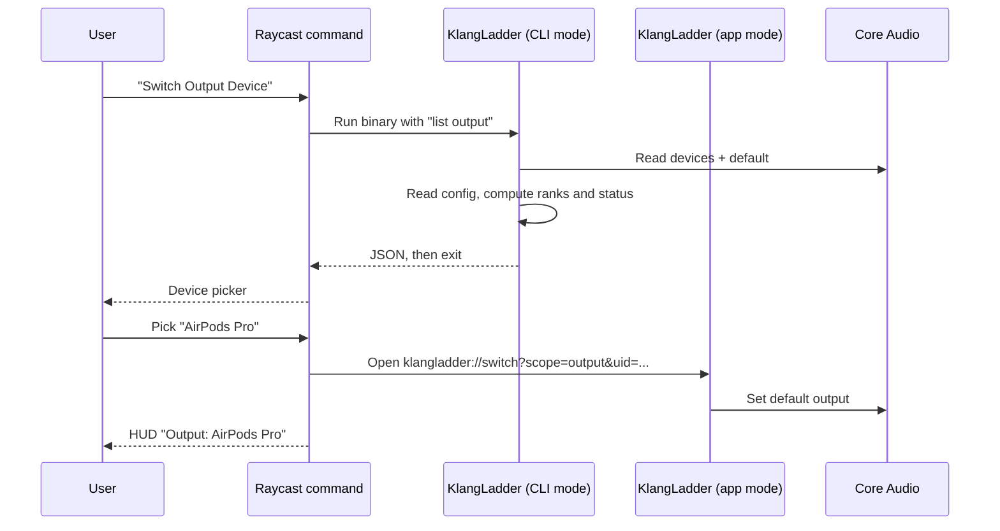

## 8. UI

### 8.1 Native menu bar popover (the app)

Click on the menu bar icon opens a SwiftUI popover.

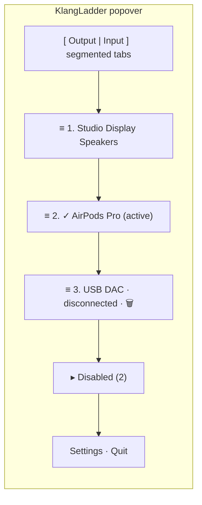

- **Tabs (G13)**: segmented control, Output and Input. Opens on the last used tab.
- **Priority list**: numbered rows, **drag and drop** to reorder. Status: active (highlighted, checkmark, G10), connected, disconnected (dimmed).
- **Disabled list (G7, G11)**: a disclosure group below the priority list.
  - Expanded automatically when the active device of this tab is disabled. Collapsed otherwise.
  - The user can expand or collapse it manually. The manual state resets when the popover closes.
  - The active device is highlighted inside it (G10).
- **Row actions**: context menu and hover buttons.
  - Priority list: Make active (connected only) · Move to top · Move to bottom · Disable · Delete (disconnected only)
  - Disabled list: Make active (connected only) · Enable (appends to bottom of priority list) · Delete (disconnected only)
- **Tooltips**: transport, last seen, UID.
- **Menu bar item**: icon only.
- **Settings**: launch at login.

The UI observes the engine directly in the same process, so it updates live with no polling.

### 8.2 Raycast commands (the extension)

For now the extension has **one command**:

| Command | Type | Does |
|---|---|---|
| **Open KlangLadder** | No view | Runs the first-run check (9.2): installs or updates the bundled app if needed. Then opens the popover through the URL scheme. |

No menu bar command, no second UI. More commands are future work (13).

## 9. Distribution

### 9.1 Channels

| Channel | Build | $99 needed? | User friction | Updates |
|---|---|---|---|---|
| **Raycast extension** (bundles the app) | Swift part built as part of the extension | No | One click on first command run | Raycast updates the extension, the extension updates its copy of the app |
| **Own Homebrew tap** (formula, built from source) | Built on the user's machine | No | Needs Xcode Command Line Tools. `brew services` handles launch at login. | `brew upgrade` |
| **GitHub release** (unsigned zip) | Prebuilt | No | Gatekeeper blocks it; user must allow it in System Settings | Manual download |
| Mac App Store *(later)* | Prebuilt, sandboxed | Yes | None | App Store |
| Official Homebrew cask *(later)* | Prebuilt, signed and notarized | Yes | None | `brew upgrade` |

All channels ship the **same app** from the same code (G16). Only the App Store build differs, by sandbox entitlements and R2 for reads.

### 9.2 Raycast first run

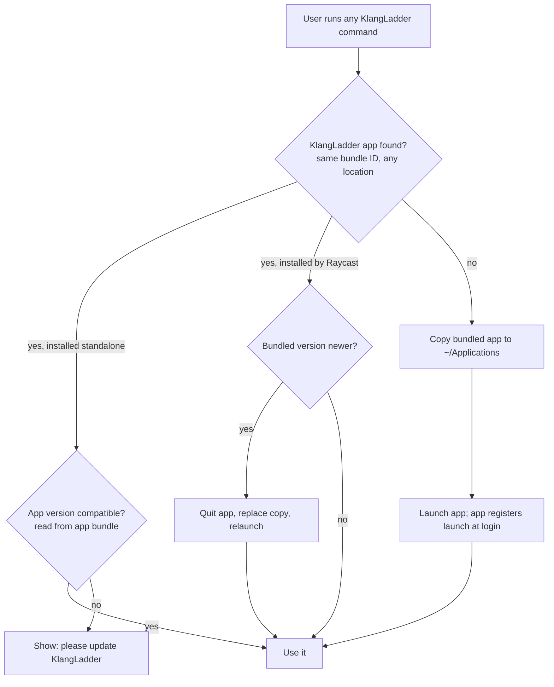

- The extension **never overwrites a standalone install**. It only updates a copy it installed itself (marked, for example, by a small marker file next to it).
- macOS shows a "Background item added" notification when launch at login is registered. Expected.
- Uninstalling the Raycast extension does not remove the app. The app has "Quit and remove from login items" in Settings.

## 10. Edge cases

- **Sleep/wake and Bluetooth reconnect storms**: many connect/disconnect events arrive at once on wake. Debounce the device-list event (about 300–500 ms) and evaluate once. With several new devices, treat the highest-ranked new device as "the connected device" for rule 6.1.
- **Active device disconnects and another device connects in the same batch**: apply 6.2 and 6.1 together. The result is the highest-ranked connected enabled device.
- **App start / login**: devices already connected at start produce no connect events. Handled once per login session (6.6).
- **Bluetooth headset mic**: selecting AirPods or similar as **input** forces a low-quality call profile, so output quality drops too. Disabling these in the Input tab is a common setup. The UI could hint at this.
- **Virtual and aggregate devices** (BlackHole, Zoom, Teams, Loopback): treated like any device. Good candidates for Disabled.
- **Same name, different UID** (two identical USB interfaces): show a disambiguating suffix (transport or short UID).
- **Device with both scopes**: independent entries per scope. It can be enabled for output and disabled for input.
- **Config schema changes**: the config has a `version` field. The app migrates on start. CLI mode reads older and newer versions it understands and reports an error otherwise.
- **Two copies installed** (standalone and Raycast-installed): single instance rule (7.2) keeps one running. The Raycast extension prefers the standalone copy (9.2).
- **App not running when Raycast opens it**: opening the URL launches the app first (standard macOS behavior).

## 11. Risks to verify first (spike)

| # | Question | If it fails |
|---|---|---|
| S1 | Can Raycast's Swift tooling (`extensions-swift-tools`) build and bundle a **full SwiftUI app** (its own entry point, `.app` bundle) inside an extension? Likely needs two targets: the Raycast bridge and the app. | Extension downloads a prebuilt app from GitHub releases on first run (but then Gatekeeper quarantine may apply), or the extension requires a Homebrew install. |
| S2 | Does the **Raycast Store** accept an extension that installs a separate menu bar app with a login item? | Publish the extension as a companion that requires the app (installed via Homebrew tap). Ask Raycast early. |
| S3 | Does a **locally built, ad-hoc signed** app run without Gatekeeper prompts, and can it register **launch at login**? | Fall back to a LaunchAgent entry in the user's LaunchAgents folder. |
| S4 | Does listing and selecting **input devices** work without microphone permission? | Request permission on first run, with an explanation. |
| S5 | Is the **auto-switch detection window** (4.4) reliable across USB, Bluetooth, and AirPlay? | Find a different signal, or accept occasional misclassification. |
| S7 | Which macOS value reliably identifies a **login session** (changes on logout/login and reboot, stays the same across app restarts)? | Fall back to system boot time. Then a logout/login without reboot does not re-apply priorities. |
| S6 | *(App Store only, later)* Can a **sandboxed** app set the default device? | No App Store variant; unsandboxed channels only. |

## 12. Open questions

None currently. Startup behavior was decided in v0.7 (6.6).

## 13. Future work

- **Standalone update check**: in-app check against GitHub releases. For now, updates are manual (GitHub) or via `brew upgrade`.
- **Raycast "Switch Output Device" / "Switch Input Device"**: device pickers. Need CLI mode (R1, 7.4) and write commands in the URL scheme (7.3).
- **Raycast "Manage Priorities"**: List view with Output/Input dropdown and actions for move, enable, disable, delete. Same needs as above.
- **App Store variant**: sandboxed build, AppleScript reads (R2). Needs the paid developer account and S6.
- **Official Homebrew cask**: needs signing and notarization, so the paid developer account.

## 14. Milestones (draft)

1. **Spike**: answer S1–S5 and S7. Core Audio listener prints events; confirm auto-switch ordering (4.4).
2. **Core**: registry, guard, switching rules, startup rule, config store. Tests from table 6.4.
3. **App**: menu bar popover with tabs, priority list, Disabled list, drag and drop, actions, launch at login, single instance.
4. **URL scheme**: open popover, with input validation.
5. **Homebrew tap**: formula building from source, `brew services` support.
6. **Raycast extension**: first-run install flow (9.2) and the Open KlangLadder command.
7. **Later**: see Future Work (13).
