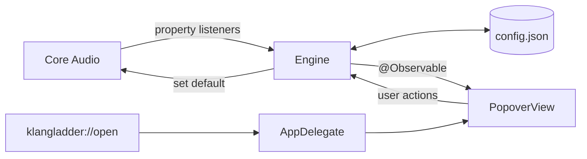
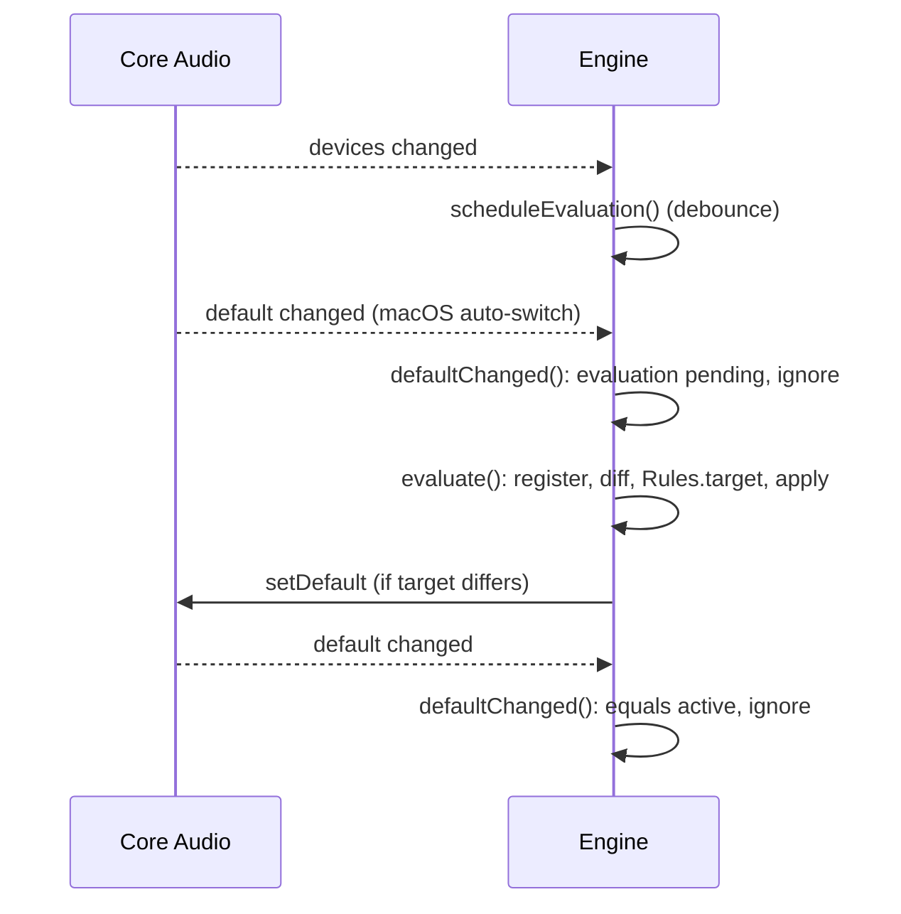

# KlangLadder – Developer Guide

This guide explains how KlangLadder is built and how it works. For the full product design and its reasoning, see [DESIGN.md](DESIGN.md). Section numbers such as (4.4) and goal numbers such as (G6) refer to that document.

## Build, run, test

```sh
swift build                      # debug build
swift test                       # unit tests (swift-testing)
./bundle.sh                      # release build to build/KlangLadder.app, ad-hoc signed
open build/KlangLadder.app
```

Run `.build/debug/KlangLadder` directly for quick checks. The unbundled binary has no bundle ID and no Info.plist. As a result, these don't work there:

- the URL scheme
- the single-instance check
- launch at login

Test them with the bundled app.

`AppBundle.swift` holds the Info.plist as a string; `bundle.sh` builds the `KlangLadder` executable, then runs it with `--bundle build/KlangLadder.app`, which calls `AppBundle.assemble` to write the bundle. The Raycast installer calls the same `AppBundle.assemble` to install the app (see below). Key values:

| Key | Value |
|---|---|
| `CFBundleIdentifier` | `dev.klangladder.KlangLadder` |
| `LSUIElement` | `true` (menu bar only, no Dock icon) |
| `CFBundleURLTypes` | scheme `klangladder` |
| `LSMinimumSystemVersion` | `14.0` |

## Layout

```
Package.swift
Sources/
  KlangLadderCore/          no UI; all logic
    Model.swift             Scope, LiveDevice, DeviceEntry, ScopeConfig, Config, Rules
    CoreAudio.swift         thin adapter over the Core Audio HAL
    Engine.swift            event handling, state, ConfigStore, LoginSession
  KlangLadderApp/           library target: the app, minus the entry point
    App.swift               AppDelegate: status item, popover, URL scheme, single instance; runApp()
    PopoverView.swift       SwiftUI popover (tabs, lists, row actions)
    AppBundle.swift         assembles and signs a KlangLadder.app around an executable
  KlangLadder/              executable target: thin entry point
    main.swift              `--bundle <path>` assembles the app, otherwise calls runApp()
Tests/
  KlangLadderCoreTests/
    RulesTests.swift        switching rules and list operations
bundle.sh                   builds KlangLadder and bundles it into build/KlangLadder.app
raycast/                    Raycast extension; bundles and installs the app (see below)
Formula/klangladder.rb      Homebrew formula (see below)
```

The design mentions a separate `KlangLadderUI` module. The views live in `KlangLadderApp` instead, because nothing but the app and the Raycast bridge use them. `KlangLadderApp` is a library (not the executable) so the Raycast extension's own binary can link it and run the app directly, without shelling out to a separate process.

## Architecture



Everything runs on the main thread. `Engine` is `@MainActor @Observable`, so the SwiftUI popover updates live without polling.

## Domain model (`Model.swift`)

- **`Scope`**: `.output` or `.input`. The two scopes are independent everywhere. A headset appears once per scope, with its own rank and its own disabled state.
- **`LiveDevice`**: a device as Core Audio reports it right now: `uid`, `name`, `transport`, `model`.
- **`DeviceEntry`**: a persisted device: `uid`, `displayName`, `transport`, `model`, `lastSeen`.
- **`ScopeConfig`**: the lists for one scope.
  - `priority: [DeviceEntry]`: the array index is the rank (index 0 = rank 1). Positions are never stored, so deleting an entry closes the gap by itself (5.1).
  - `disabled: [DeviceEntry]`: unranked.
  - A device is in exactly one of the two lists. Being enabled means being in `priority`.
- **`Config`**: `version` plus one `ScopeConfig` per scope, with `config[scope]` subscript access.

**Identity.** The Core Audio `AudioDeviceID` changes across reconnects and reboots. The persistent key is the device **UID** string.

**Rank.** `rank(uid)` returns the array index, or `nil` for disabled or unknown devices. `nil` means rank −∞. `best(among:)` returns the highest-ranked enabled device among a set of UIDs.

### Registering devices (`ScopeConfig.register`)

The engine calls `register` with the connected devices on start and on every device-list change. For each device:

1. **Known UID:** refresh name, transport, model and `lastSeen`.
2. **Unknown UID, fallback matching (5.3):** some USB devices get a new UID on another port. The engine looks for entries in the same scope that are **disconnected** and have the same name, transport and model.
   - **Exactly one match:** that entry adopts the new UID. It keeps its position, or stays disabled.
   - **None or several matches:** go to step 3. With several matches, guessing could mix up two identical interfaces.
3. **Otherwise:** append a new entry to the bottom of `priority` (G14).

## Switching rules (`Rules.target`)

`Rules.target` is a pure function, so it is fully unit-testable. It gets a snapshot after a device-list change:

| Parameter | Meaning |
|---|---|
| `config` | the scope's lists |
| `connected` | UIDs connected now |
| `added` / `removed` | difference to the previous evaluation |
| `previous` | the default **before** the event, ignoring any macOS auto-switch (4.4) |
| `current` | the default Core Audio reports now |

It returns the UID that should become the default, or `nil` to leave `current` alone. The checks run in order:

1. **Guard (6.0):** no enabled device connected: `nil`, macOS decides (G8, G9).
2. **Active device disconnected (6.2):** `previous` is in `removed`: return the best connected device. This also covers mixed batches, where one device leaves and another joins (section 10).
3. **Higher-ranked device connected (6.1, G4):** the best newly added enabled device outranks `previous`: return it. A disabled or unknown `previous` ranks −∞, so any enabled device wins.
4. **Undo auto-switch (6.1):** macOS switched `current` to a newly added device, `current != previous`, and `previous` is still connected: return `previous`.
5. Otherwise `nil`.

## Engine (`Engine.swift`)

### State

- `config`: loaded from disk, saved after every change.
- `connected[scope]`: UIDs from the last evaluation. Used to compute `added` and `removed`.
- `active[scope]`: the **recorded** default. It follows manual choices and KlangLadder's own switches, but not a macOS auto-switch that is still being judged. The UI uses it for the checkmark.
- `recentConnect[scope]`: time, added UIDs and `previous` of the last connect. Used for late auto-switch events.

### Calibration knobs

| Property | Default | Meaning |
|---|---|---|
| `debounceDelay` | 0.4 s | Groups bursts of device-list events, for example Bluetooth reconnects after wake (section 10) |
| `autoSwitchWindow` | 2 s | A default change to a new device within this time counts as a macOS auto-switch (4.4) |

Both values are guesses. See issue #6 (spike S5).

### Event flow



- **`start()`**
  1. `LoginSession.claim()` returns true on the first start in this login session (6.6, G20).
  2. For each scope: read devices and the default, and `register` the devices.
  3. **Very first run** (empty config): sort the current default to the front, so it becomes rank 1 and nothing switches unexpectedly. The design does not cover this case.
  4. On the first start of a session only, `apply` the best connected device.
  5. Save, then install the Core Audio listeners.
- **`scheduleEvaluation()`**: any device-list change restarts a `DispatchWorkItem` debounce timer.
- **`evaluate()`**: for each scope, register devices, diff against `connected`, call `Rules.target` with `previous = active[scope]`, then `apply`. Remembers `recentConnect` if devices were added.
- **`defaultChanged(scope)`**
  - Evaluation pending: ignore. `evaluate()` reads the default itself, so `previous` stays the pre-connect default.
  - New default equals `active`: ignore. This is KlangLadder's own switch, or no change.
  - New default is a device from `recentConnect` within `autoSwitchWindow`: a late macOS auto-switch. Re-run `Rules.target` against the stored `previous`.
  - Otherwise: a manual choice. Record it in `active` (G6).
- **`apply(target, current:, scope)`**: sets the default if `target` differs from `current`. If `setDefault` fails, `active` keeps `current`, so it never shows a device that isn't really active.

### User actions

These never trigger a switch (6.0):

- `edit(scope) { ... }`: reorder, move to top or bottom, enable, disable. Mutates the `ScopeConfig`, then saves.
- `delete(uid, scope)`: re-reads Core Audio first. If the device reconnected since the UI was drawn, the delete is rejected and `lastError` is set (5.1 race).
- `makeActive(uid, scope)`: sets the default and records it as the manual choice.

## Core Audio adapter (`CoreAudio.swift`)

Public HAL API only. No entitlements, no microphone permission needed.

| Need | Property |
|---|---|
| Device list | `kAudioHardwarePropertyDevices` on `kAudioObjectSystemObject` |
| Default device | `kAudioHardwarePropertyDefaultOutputDevice` / `...DefaultInputDevice`, read and written |
| Device in scope | `kAudioDevicePropertyStreams` non-empty **and** `kAudioDevicePropertyDeviceCanBeDefaultDevice == 1` in that scope |
| Identity | `kAudioDevicePropertyDeviceUID`, `kAudioObjectPropertyName`, `kAudioDevicePropertyModelUID` |
| Transport | `kAudioDevicePropertyTransportType`, mapped to "USB", "Bluetooth", "Built-in", … |

Listeners use `AudioObjectAddPropertyListenerBlock` on the main queue: one for the device list and one per default-device property. `setDefault` resolves the UID to the current `AudioDeviceID` with a linear scan.

## Persistence

All files live in `~/Library/Application Support/KlangLadder/`.

- **`config.json`**: pretty-printed JSON with sorted keys and ISO-8601 dates. Written atomically (temp file, then rename). Only the running app writes it.
  - Unreadable, or `version` newer than 1: the app moves the file to `config.unreadable-<timestamp>.json` and starts empty. It never overwrites a file it couldn't read.
  - No schema migrations exist yet. Add them in `ConfigStore.load` when `version` 2 appears.
- **`session`**: the login session ID from the last first start. `LoginSession.current` combines the boot time (`sysctl kern.boottime`) with the audit session ID (`getaudit_addr`, `ai_asid`). It is not yet confirmed that this changes on logout/login. See issue #5 (spike S7).

Example:

```json
{
  "input" : { "disabled" : [], "priority" : [ { "displayName" : "MacBook Pro Microphone", "lastSeen" : "2026-09-17T14:14:59Z", "model" : "Digital Mic", "transport" : "Built-in", "uid" : "BuiltInMicrophoneDevice" } ] },
  "output" : { "disabled" : [], "priority" : [ ... ] },
  "version" : 1
}
```

## App shell (`App.swift`)

- **Entry:** plain `NSApplication` with `.accessory` activation policy. Not the SwiftUI `App` lifecycle, because the URL scheme needs to open the popover from code. `public func runApp() -> Never` is the entry point; `KlangLadder/main.swift` and the Raycast bridge both call it.
- **Status item:** an `NSStatusItem` with the SF Symbol `hifispeaker.2`. It is icon only (non-goal: device name in the menu bar).
- **Login item:** if launched with `--register-login-item`, registers via `SMAppService.mainApp` on start. The Raycast installer passes this flag on a fresh install (see below).
- **Popover:** an `NSPopover` with `.transient` behavior.
  - Each open creates a fresh `NSHostingController`, so the manual expand/collapse state of the Disabled list resets (8.1).
  - Size is fixed at 380×460 with `sizingOptions = []`. Without this, `List` reports an unstable ideal size and the popover grows off-screen.
- **Single instance (G19):** at launch, if another app with the same bundle ID runs, post the distributed notification `dev.klangladder.open` and quit. The running instance opens its popover.
- **URL scheme (7.3):** `application(_:open:)` accepts only `klangladder://open`. Everything else is ignored, because any local app or web page can open these URLs.

## Popover (`PopoverView.swift`)

- The segmented tab is stored in `@AppStorage("lastTab")`.
- The priority list is a `ForEach` with `.onMove` for drag and drop. It writes through `engine.edit`.
- The Disabled list is a `DisclosureGroup`. `isExpanded` is the user's manual toggle if set, else "the active device is disabled" (G11).
- **`DeviceRow`**
  - Tap on a connected device: `makeActive`.
  - Context menu and hover `…` menu share one action list.
  - Hover trash button for disconnected devices.
  - Tooltip shows transport, last seen and UID.
  - Duplicate names get a transport suffix (section 10).
- The launch at login toggle uses `SMAppService.mainApp`. Errors show in the red error line.

## Tests

`Tests/KlangLadderCoreTests/RulesTests.swift` uses swift-testing and covers:

- the `Rules.target` rows of table 6.4, plus mixed batches and disabled-device cases
- `best(among:)`
- `register` and fallback matching (5.3)
- delete, enable, disable, move to top and move to bottom

Not covered yet: engine-level behavior (manual changes, startup once per session, late auto-switch, delete race). `Engine` uses Core Audio, the file system and the session marker directly. Issue #8 tracks adding a seam for fakes.

Manual checks on hardware are tracked in issues #5, #6 and #7.

## Raycast extension

`raycast/` bundles the app (9.2, spike S1 solved). One command, **Open KlangLadder** (`raycast/src/open.ts`, `mode: "no-view"`), calls into Swift and opens the popover.

### The bridge is the app

`raycast/swift/` is a Swift package, `KlangLadderRaycast`, for Raycast's `extensions-swift-tools`. It depends on the root package with `.package(path: "../..")` and links `KlangLadderApp`. Because the repo folder is named `KlangLadder`, that dependency resolves as `.product(name: "KlangLadderApp", package: "KlangLadder")` — SwiftPM derives a path dependency's package identity from its folder name, so **the repo must stay checked out as a folder named `KlangLadder`** for this to build.

The target uses only `RaycastTypeScriptPlugin`, not `RaycastSwiftPlugin`, because it supplies its own `main.swift` (`raycast/swift/Sources/main.swift`) instead of the generated one. That file does the same dispatch the generated main would: if `argv[1]` names an exported `@raycast` function, it runs that function; otherwise it calls `runApp()`. `ray build` compiles this into one universal binary via `xcodebuild` (`assets/compiled_raycast_swift/swift`), so the same binary is both the Raycast bridge and the app. Building it needs **Xcode 16.3 or later** (not just the Command Line Tools), per `extensions-swift-tools`.

### Install and update (`Install.swift`)

`@raycast func openKlangLadder()` runs on every invocation of the command:

1. **Look for a standalone copy.** `NSWorkspace.urlsForApplications(withBundleIdentifier:)` finds every app with the KlangLadder bundle ID. Any copy that isn't the one this extension installed — built from source, a Homebrew keg, a manual copy in `~/Applications` without the marker below — is used as-is and never modified or replaced.
2. **Otherwise, install or update `~/Applications/KlangLadder.app`.** It's installed when missing, and updated when the SHA-256 of the bundled binary differs from the hash recorded in the marker file `~/Library/Application Support/KlangLadder/raycast-installed`. A hash, not a version number, because codesign rewrites the installed binary so byte-for-byte comparison doesn't work. Before replacing, it terminates any running copies and polls for up to 5 seconds for them to exit.
3. **Open it.** `NSWorkspace.open(_:withApplicationAt:configuration:)` with `klangladder://open`, launching the app if needed. On a fresh install, the launch configuration passes `--register-login-item`.

### Verified by hand

- `ray build` and `ray lint` pass.
- Running the bridge with a standalone copy present opened that copy, untouched.
- A fresh install created a signed app with no quarantine xattr, launched it, and registered and enabled the login item (S3 holds for this path).
- The update path quit the running copy, replaced it, and relaunched.
- A repeat run with nothing to do took 0.08 s.

### Known limits

- The path dependency ties the extension to the repo folder being named `KlangLadder` (above). Publishing to the Raycast Store (extensions live in the `raycast/extensions` monorepo) needs the dependency switched to `.package(url: "https://github.com/janthoXO/KlangLadder", from: <first tag>)` after the first release — see issue #3. Store acceptance itself (S2) is still open.
- Not tested from inside the Raycast UI (`npm run dev`) — only by running the compiled bridge the way Raycast spawns it.
- The standalone-version compatibility check from 9.2 is skipped: the only command sent is `klangladder://open`, which every version supports.
- Uninstalling the extension does not remove the installed app.

## Homebrew formula

`Formula/klangladder.rb` makes this repository its own tap. `brew tap janthoXO/klangladder <repo URL>` is needed because the repository is not named `homebrew-klangladder`.

- The formula is head-only for now. After the first tag (#3), add `url` with `tag:` and `revision:` so `brew install` and `brew upgrade` work without `--HEAD`.
- `install` runs `bundle.sh --disable-sandbox`. SwiftPM's own sandbox can't run inside Homebrew's build sandbox, so `bundle.sh` passes its arguments on to `swift build`.
- The app lands in the keg, at `$(brew --prefix)/opt/klangladder/KlangLadder.app`.
- `service` runs the app binary through a LaunchAgent (`sh.brew.klangladder`). If another copy is already running, the single instance rule makes the new one quit.
- `test` checks that the binary exists and the ad-hoc signature verifies.

To test changes locally, copy the formula into a local tap, then install:

```sh
brew tap-new --no-git local/klangtest
# point `head` at file:///path/to/KlangLadder with branch: "<your branch>"
cp Formula/klangladder.rb "$(brew --repository)/Library/Taps/local/homebrew-klangtest/Formula/"
brew install --HEAD local/klangtest/klangladder
brew audit --strict --formula local/klangtest/klangladder
brew test local/klangtest/klangladder
```

## Roadmap

See the GitHub issues and DESIGN.md sections 13–14. Main open items:

- Homebrew: stable version after the first tag (#1, #3)
- Raycast extension (#2) — the extension bundles and installs the app (9.2, S1); Raycast Store acceptance (S2) and switching the path dependency to a tagged release are still open
- GitHub releases (#3)
- CLI mode for reads (#11)
- URL write commands (#12)
